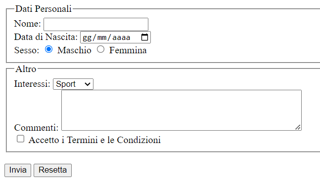
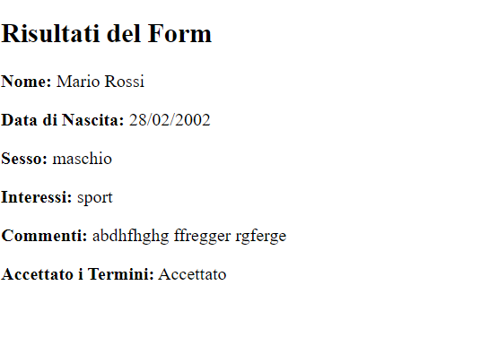

# Form Completo

Realizzare un form come in figura 

I valori della select box "Interessi" sono
- Sport
- Musica
- Viaggi

Il form richiama una pagina php che visualizza i risultati del form come tanti paragrafi. Notare che la data è espressa in formato italiano (dd/mm/yyyy).

