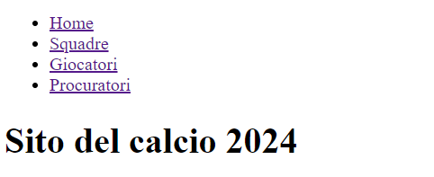
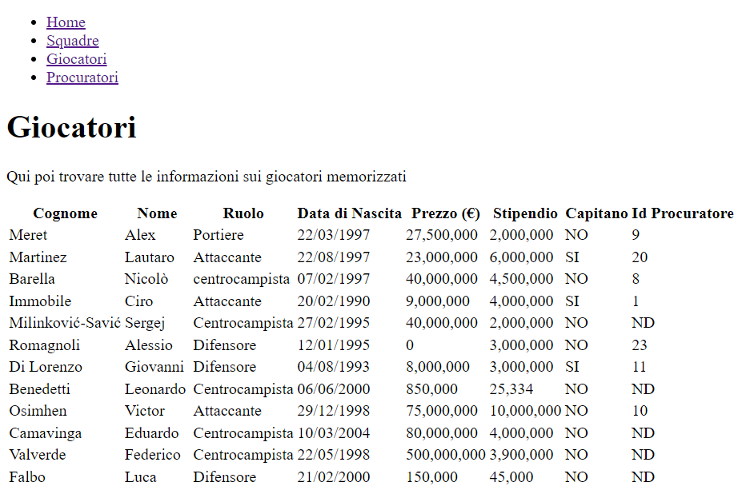
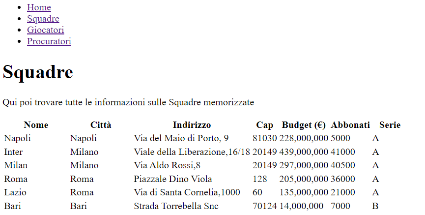
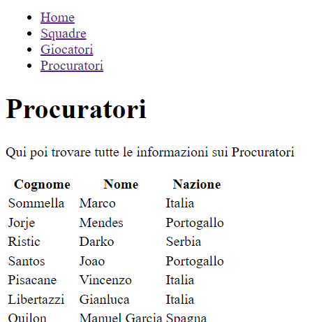

# Calcio 3 - Realizzazione del Sito
Creare un sito in HTML ed eventualmente CSS che ha 4 pagine
* `index.html` con informazioni sul contenuto del datbase e sulle informazioni che possiamo estrarre
* `giocatori.php`
* `squadre.php`
* `procuratori.php`

le pagine `giocatori.php`, `squadre.php`, `procuratori.php` hanno un body con una sola descrizione a piacere e visualizzano prelevando dal DB la corrispondente **tabella**  con tutte le informazioni escluso l'ID.

Di segutio rispettivamete un'immagine della index, giocatori, squadre, procuratori.

Rispettare inoltre le seguenti specifiche:
* Per la tabella `squadre` il campo `Budget` usare un formato numerico in modo da visualizzare un separatore per le migliaia.
* Per la tabella `giocatori` 
    - per il campo `Capitano` visualizzare `No` o `Si`, 
    - nel caso in cui il procuratore è assente scrivere la stringa `ND` (che sta per "Non Disponbile")
    - per il campo `Data_nascita` usare la classe `DataTime` per ottenere una stringa formattata nel modo `gg/mm/aaaa` (ad esempio `15/02/1994`)

Tutte le pagine, compresa la `index.html`, hanno un menu con link per passare da una pagina all'altra.
