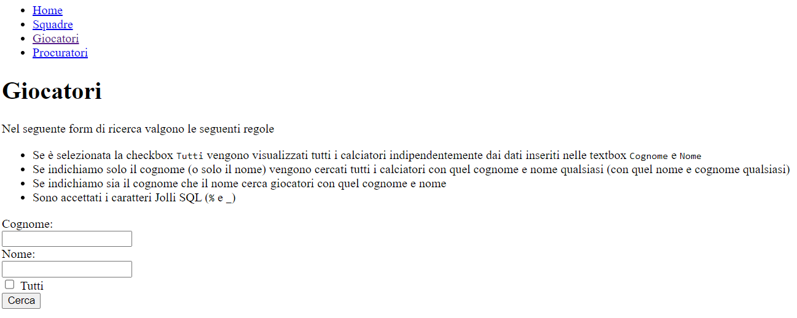

# Calcio 4 - Form Ricerca Calciatori
Modificare il progetto `03-Calcio3` in modo che la pagina `giocatori.php` diventa una pagina html quindi di nome `giocatori.html` e che presenta un form che chiede all'utente di inserire dei dati su un giocatore per visualizzare tutti i giocatori che rispettano quei dati, come nella figura seguente

 

precisaemente
* Se è selezionata la checkbox `Tutti` vengono visualizzati tutti i calciatori indipendentemente dai dati inseriti nelle textbox `Cognome` e `Nome`
* Se indichiamo solo il cognome (o solo il nome) vengono cercati tutti i calciatori con quel cognome e nome qualsiasi (con quel nome e cognome qualsiasi)
* Se indichiamo sia il cognome che il nome cerca giocatori con quel cognome e nome
* Sono accettati i caratteri Jolli SQL (`%` e `_`)

Nel momento in cui l'utente fa ul submit del form viene chiamata una pagina di nome `giocatori_elab.php` che mostra i risultati della ricerca (oltre al solito menu del sito)

