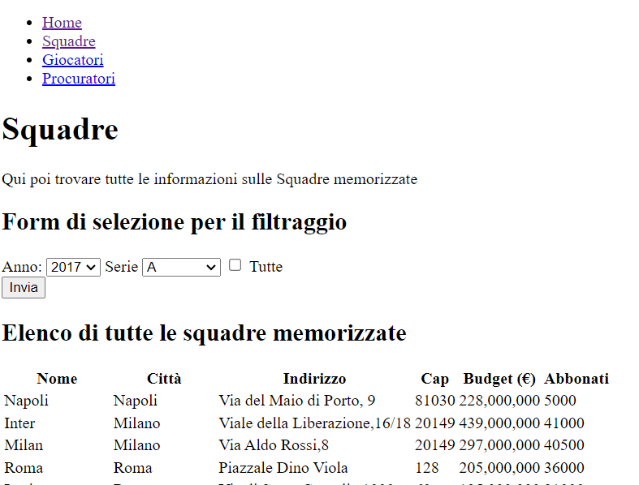
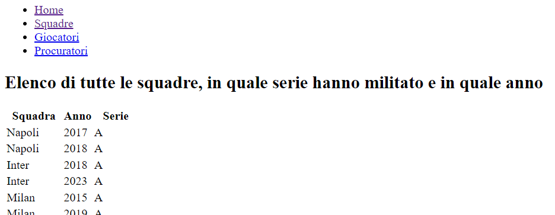
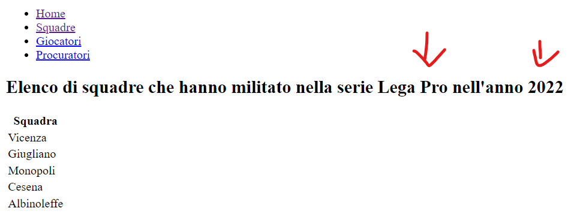

# Calcio 6 - Tabella e Form Squadre

Aggiungere al database una nuova tabella di nome `squadre_anno`, con dei valori a piacere,  che abbia i seguenti campi
* `Id`: Identificativo della squadra (preso dalla tabella `squadre`); 
* `Anno`: anno di riferimento;
* `Serie`: Uno dei seguenti valori `Lega Pro`, `Serie A`, `Serie B` a seconda se la squadra in questione ha militato nell'anno in questione in Lega Pro, Serie B o serie A.

Individuare per tale tabella la chiave primaria ed eventuali chiavi esterne.

Salvare, nella cartella del progetto, in un file testo di nome `squadre_anno.sql` le istruzioni SQL per la creazione delle squadre e l'inserimento dei valori di una tabella 

Modificare il file `squadre.php` aggiungendo, prima di stampare la tabella di tutte le squadre memorizzate, un modulo html  con due caselle a discesa (select box)  una per l'anno (inserire alcuni anni sfruttando PHP) e l'altra per la serie (con i seguenti valori: `Lega Pro`, `Serie A`, `Serie B`) e una checkox `Tutte`.

 

Cliccando sul pulsante di submit viene visualizzato in una nuova pagina di nome `squadre_elab.php` un elenco delle squadre presenti in quell'anno e in quella categoria, precisamente 
* Se è stata selezionata la checkbox `Tutte` viene mostrato tutto il contenuto della tabella `squadre_anno` (escluso l'`Id`). Far precedere la tabella da un titolo che sia `Elenco di tutte le squadre, in quale serie hanno militato e in quale anno`

* Se **NON** è stata selezionata la checkbox `Tutte` viene visualizzata una tabella con il solo il nome delle squadre per l'anno e la serie selezionata. Far precedere la tabella da un sitolo che sia `Elenco di squadre che hanno militato nella serie <serie> nell'anno <anno>` dove in luogo di `<serie>` e `<anno>` c'è la serie e l'anno selezionato.

